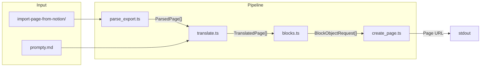

# Notion Interview Script

## Architecture




## Data Flow

1. **Scan** `input/import-page-from-notion/` for all `+*.md` parent pages
2. **Parse** each parent page to extract: title (strip `+` prefix and Notion ID), optional intro content, sections (bold headings + numbered questions), subpage links
3. **Read** subpage `.md` files to get English answer markdown (handle multiple subpages per question)
4. **Translate** all English answers to Polish using OpenAI (concurrent, rate-limit safe)
5. **Build** Notion blocks (reuse first-notion-integration's heading/toggle/question pattern)
6. **Create** Notion pages, batching API calls if >100 top-level blocks

## Types (`types.ts`)

Extend the first-notion-integration types. Reuse `BlockObjectRequest` and `NestedBlockObjectRequest` derivations. New domain types:

```typescript
interface ParsedQuestion {
  readonly text: string;               // question text (may be multiline)
  readonly answerMarkdowns: readonly string[];  // 1+ subpage contents
}

interface ParsedSection {
  readonly heading?: string;           // undefined for pages with no headings
  readonly questions: readonly ParsedQuestion[];
}

interface ParsedPage {
  readonly title: string;              // cleaned (no + prefix, no Notion ID)
  readonly introContent?: string;      // optional content before first heading
  readonly sections: readonly ParsedSection[];
}

interface TranslatedQuestion extends ParsedQuestion {
  readonly translatedMarkdowns: readonly string[];  // Polish translations
}

interface TranslatedPage {
  readonly title: string;
  readonly introContent?: string;
  readonly sections: readonly {
    readonly heading?: string;
    readonly questions: readonly TranslatedQuestion[];
  }[];
}
```

## Key Feature Modules

### `parse_export.ts` -- Parsing Notion exports

Parses a parent `.md` file and its subpage folder:

- **Title**: strip leading `+` and trailing  `<32-char-hex-id>` from the H1 line and filename
- **Intro content**: everything between the title and the first bold heading or numbered question (e.g., the "Pomocne:" links in Clean Code)
- **Sections**: detect bold lines as headings (patterns: `**text`**, `emoji **text`**, `**emoji text**`); if no bold headings found, treat all questions as one section with `heading: undefined`
- **Questions**: match numbered patterns (`1.`, `2.`, etc.); capture multiline question text (everything until the next `[link](path)` or next numbered question)
- **Subpage links**: extract `[title](relative-path)` links after each question; read the referenced `.md` files; strip the H1 title line from answer content (it repeats the question)
- **Multiple subpages**: a question like Clean Code Q2 has two `[...](...)` links -- collect both answer markdowns into `answerMarkdowns[]`

Edge cases from [+Clean Code](scripts/notion-interview/input/import-page-from-notion/+Clean%20Code%20302194b2c35f80c08abfd17ff0f24c20.md):

- Intro content before first heading (lines 3-7)
- Multiline question with sub-items (lines 15-42)
- Two subpages for one question (lines 44-46)

### `translate.ts` -- OpenAI translation with concurrency

- Read the system prompt from `input/prompty.md` at runtime
- Use `generateText` from the AI SDK with `openai("gpt-4o-mini")` (same pattern as [openai-chat](scripts/openai-chat/features/chat.ts))
- **Concurrency pool**: process up to `CONCURRENCY_LIMIT` (default 5) translations simultaneously using an index-based worker pool pattern -- preserves question order without a sorting step
- Accept `model` and `concurrency` as DI parameters for testability
- Each call sends the system prompt + the English answer markdown, returns the Polish markdown

Worker pool pattern (no external dependency):

```typescript
async function translateAll(
  answers: readonly string[],
  systemPrompt: string,
  model: LanguageModel = openai("gpt-4o-mini"),
  concurrency = CONCURRENCY_LIMIT,
): Promise<string[]> {
  const results = new Array<string>(answers.length);
  let nextIndex = 0;
  async function worker() {
    while (nextIndex < answers.length) {
      const i = nextIndex++;
      results[i] = await translateOne(answers[i], systemPrompt, model);
    }
  }
  await Promise.all(Array.from({ length: concurrency }, worker));
  return results;
}
```

Why concurrency=5 is safe: `gpt-4o-mini` allows 500 RPM at tier 1, 5000+ at tier 2. With 5 concurrent workers and ~2-3s per translation, we reach ~100-150 RPM -- well within limits. For 100 questions, total time drops from ~5min (sequential) to ~1min.

### `blocks.ts` -- Notion block construction

Reuse the same nesting rules from [first-notion-integration/blocks.ts](scripts/first-notion-integration/features/blocks.ts):

- First section heading inside an empty paragraph child
- Later section headings appended as last child of previous section's last question
- Questions as `numbered_list_item` with 3 toggles (en/pl/more)

Key difference: instead of placeholder text in toggles, use `**@tryfabric/martian**` `markdownToBlocks()` to convert answer markdown into proper Notion blocks (headings, bullets, code blocks, etc.) as toggle children.

For questions with multiple answers, concatenate with a heading separator inside the same toggle:

```
en toggle children:
  [blocks from answer 1]
  [divider]
  [blocks from answer 2]
```

For the `**more**` toggle: keep a placeholder paragraph ("") so the user can expand and add content later in Notion.

**Intro content**: if present, convert to Notion blocks via `markdownToBlocks()` and prepend before the heading/question structure.

**No-heading pages**: skip the empty paragraph wrapper; start directly with `numbered_list_item` blocks.

**Batching for large pages**: Notion API allows max 100 children per `pages.create` call. For pages with 100+ questions:

1. Create the page with the first 100 top-level blocks
2. Append remaining blocks via `client.blocks.children.append()` in batches of 100

### `create_page.ts` -- Notion page creation

Similar to [first-notion-integration/create_page.ts](scripts/first-notion-integration/features/create_page.ts) but with batching support for large pages. Accept the Notion `Client` instance via DI.

## Prompt Improvement (`input/prompty.md`)

Improve from the current one-liner to a structured prompt:

```
You are a Senior Frontend Engineer preparing for a technical interview in Polish.

Translate the following technical answer from English to Polish.

RULES:
- Preserve the exact markdown structure (headings, bullets, code blocks, indentation)
- Keep technical terms commonly used in English in the Polish tech community
  (e.g., "clean code", "composable", "store", "refactoring", "trade-off")
- The translation should read naturally and clearly in Polish, not word-for-word
- Preserve code examples exactly as-is (do not translate code, variable names, or comments in code)
- Maintain the same level of conciseness and information density
- Keep "Mental model:" label in English
- Translate markdown headings to Polish (e.g., "## Core Answer" -> "## Kluczowa odpowiedz",
  "## More details" -> "## Wiecej szczegolow", "## Minimal Example" -> "## Minimalny przyklad")
```

## File Structure

```
scripts/notion-interview/
  README.md
  main.ts                          # thin entry: await main()
  mod.ts                           # orchestration: env, scan, parse, translate, create
  types.ts                         # ParsedPage, TranslatedPage, block types (reuse pattern)
  constants.ts                     # CONCURRENCY_LIMIT, toggle labels/colors
  features/
    parse_export.ts                # parseExportFolder() -> ParsedPage[]
    parse_export_test.ts
    translate.ts                   # translatePage() with concurrency pool
    translate_test.ts              # MockLanguageModelV1
    blocks.ts                      # buildPageBlocks() -> BlockObjectRequest[]
    blocks_test.ts
    create_page.ts                 # createInterviewPage() with batching
    create_page_test.ts
  input/                           # already exists
    import-page-from-notion/       # Notion exports go here
    original-prompt.md
    prompty.md
  output/.gitkeep
```

## `deno.json` Changes

- **Task**: `"notion-interview": "deno run --env-file --allow-net --allow-env --allow-read scripts/notion-interview/main.ts"`
- **Import**: `"@tryfabric/martian": "npm:@tryfabric/martian@^1"`

## Environment Variables

Reuses existing: `OPENAI_API_KEY`, `NOTION_API_KEY`, `NOTION_PAGE_ID` (parent page where interview topic pages will be created).

## Testing Strategy

- `**parse_export_test.ts`**: test against the actual sample exports in `input/import-page-from-notion/` -- verify title cleaning, intro extraction, section/question parsing, multiline questions, multiple subpages
- `**translate_test.ts`**: `MockLanguageModelV1` returns a fixed string; verify concurrency preserves order, system prompt is included
- `**blocks_test.ts`**: verify block structure matches first-notion-integration patterns (heading nesting, toggle colors, content inside toggles, no-heading case, intro blocks)
- `**create_page_test.ts`**: mock Notion client; verify batching triggers at >100 blocks

