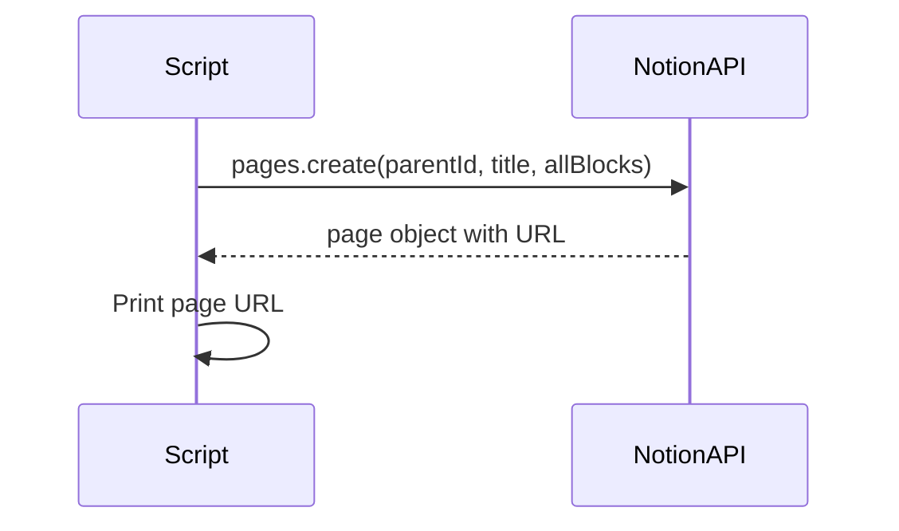

# Notion Template Page Creator Script (revised)

## Actual Template Structure (from Notion MCP fetch)

The Notion MCP `fetch` tool returned the real page structure, which differs from the original plan in important ways:

```
Page: "{title}"
├── Paragraph (empty)
│   └── Heading 2: "**Podstawy**" (bold, nested child)
├── 1. Pytanie1
│   ├── Toggle (green_background): "en" → placeholder paragraph
│   ├── Toggle (red_background): "pl" → placeholder paragraph
│   └── Toggle (default): "more" → placeholder paragraph
├── 2. Pytanie2
│   ├── Toggle (green_background): "en" → placeholder paragraph
│   ├── Toggle (red_background): "pl" → placeholder paragraph
│   ├── Toggle (default): "more" → placeholder paragraph
│   └── Heading 2: "**Praktyka**" (bold, nested child of item 2)
├── 3. Pytanie3
│   ├── Toggle (green_background): "en" → placeholder paragraph
│   ├── Toggle (red_background): "pl" → placeholder paragraph
│   └── Toggle (default): "more" → placeholder paragraph
```

### Corrections vs. original plan

- **Color**: English toggle is `green_background` (not `teal_background`)
- **Nesting**: Headings are children of other blocks, not flat top-level blocks
  - "Podstawy" = child of an empty paragraph block
  - "Praktyka" = child of numbered list item 2 (after its toggles)
- **Bold headings**: Heading rich_text uses `annotations.bold = true`

## API Strategy (simplified)

The deepest nesting path is: numbered_list_item -> toggle -> paragraph = **exactly 2 levels**, which is the Notion API limit for a single `pages.create()` call. This means the **entire page can be created in 1 API call** -- no multi-step flow needed.



## File Structure

```
scripts/first-notion-integration/
├── main.ts              # Entry point: env validation, CLI args, orchestration
├── create_page.ts       # Logic: template types, block builders, page creation
└── create_page_test.ts  # Tests with mocked Notion client
```

## Key Files and Changes

### 1. [scripts/first-notion-integration/create_page.ts](scripts/first-notion-integration/create_page.ts)

- `PageTemplate` interface: title, sections (each section = heading text + array of questions)
- `DEFAULT_TEMPLATE` constant matching the Obszar structure: section "Podstawy" with 2 questions, section "Praktyka" with 1 question
- `buildBlocks(template: PageTemplate): BlockObjectRequest[]` -- pure function that builds the full block tree:
  - First section heading wrapped as a child of an empty paragraph block
  - Subsequent section headings appended as children of the last question in the previous section
  - Each question = numbered_list_item with toggle children (green_background "en", red_background "pl", default "more"), each toggle containing a placeholder paragraph child
  - Bold annotations on heading rich_text
- `createNotionPage(client, parentPageId, template): Promise<string>` -- single `client.pages.create()` call with the full block tree, returns the page URL
- Uses dependency injection: `client` parameter typed as `InstanceType<typeof Client>` from `@notionhq/client`

### 2. [scripts/first-notion-integration/main.ts](scripts/first-notion-integration/main.ts)

- Validate `NOTION_API_KEY` and `NOTION_PAGE_ID` via `getEnv()` from [shared/env.ts](shared/env.ts)
- Parse optional CLI arg for page title (defaults to "Obszar")
- Initialize `Client` from `@notionhq/client`
- Call `createNotionPage()` and print the resulting URL

### 3. [scripts/first-notion-integration/create_page_test.ts](scripts/first-notion-integration/create_page_test.ts)

- Test `buildBlocks()`:
  - Correct number and types of top-level blocks (1 paragraph + N numbered_list_items)
  - First block is empty paragraph with heading_2 "Podstawy" child (bold)
  - Each numbered_list_item has 3 toggle children with correct colors
  - Toggles contain placeholder paragraph children
  - Last question of first section has heading_2 "Praktyka" as final child (bold)
- Test `createNotionPage()` with a mock client that captures the call args

### 4. [deno.json](deno.json) updates

- Add import: `"@notionhq/client": "npm:@notionhq/client@^2"`
- Add task: `"notion-page": "deno run --env-file --allow-net --allow-env scripts/first-notion-integration/main.ts"`

### 5. [.env.example](.env.example) updates

- Add: `NOTION_API_KEY=ntn_your-integration-secret-here`
- Add: `NOTION_PAGE_ID=your-parent-page-id-here`

## Usage

```bash
deno task notion-page
deno task notion-page "My Custom Area"
```

## Verification via Notion MCP

After implementation, we can use the Notion MCP `fetch` tool to verify the created page matches the expected structure by comparing its markdown output against the original Obszar page.
